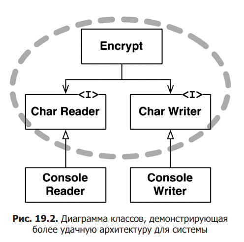

# Чистая архитектура. Роберт Мартин

## Глава 1. Что такое дизайн и архитектура?

1. Цель архитектуры программного обеспечения - уменьшить человеческие трудозатраты на создание и сопровождение системы.

2. К построению правильной архитектуры надо относиться со всей серьезностью с самого начала. Если  не обращать
  внимания на беспорядок в коде, то он будет накапливаться и усложнять и тормозить весь процесс
  поддержания и обновления кода.

## Глава 2. История о двух ценностях

1. Программная система имеет две разные ценности: поведение и структуру.

2. Программное обеспечение должно быть податливым, т.е. должна быть возможность легко изменить его поведение.

3. Сложность изменения кода (поведения программы) должна быть пропорциональна лишь масштабу изменения,
  но никак не его форме.

## Глава 3. Обзор парадигм

1. Структурное программирование накладывает ограничение на прямую передачу управления
  (появление `if/then/else` и `do/while/until` вместо `goto`).

2. Объектно-ориентированное программирование накладывает ограничение на косвенную передачу управления (полиморфизм).

3. Функциональное программирование накладывает ограничение на присваивание (неизменяемость данных).

## Общие принципы

#### Уровни модулей в системе

1. Более низкоуровневые модули должны зависеть от высокоуровневых. Низкоуровневые модули можно назвать "плагинами".
  Плагины могут заменяться и подключаться к высокоуровневым модулям, реализуя нужный интерфейс.

2. Высокоуровневые части системы меняются редко, но по важным причинам. Низкоуровневые части меняются часто,
  но по менее важным причинам. Как минимум из-за их частого изменения их следует отгораживать от высокого уровня.

3. Чем дальше модуль/компонент/класс от какого-либо I/O, тем он имеет более высокий уровень в системе.

4. Направления зависимостей между двумя частями системы должны идти только в одном направлении.

5. Направление зависимостей между частями системы могут не совпадать с направлением потоков данных.

6. Пример плагина - новое устройство I/O для программы шифрования данных.
  Высокоуровневый модуль, который реализует алгоритм шифрования, ничего не знает про конкретные устройства I/O - он
  зависит только от интерфейсов для них. Низкоуровневые модули (плагины) знают про модуль шифрования и зависят от него,
  реализуя нужный интерфейс.

    

      
Пример архитектуры

      
    

